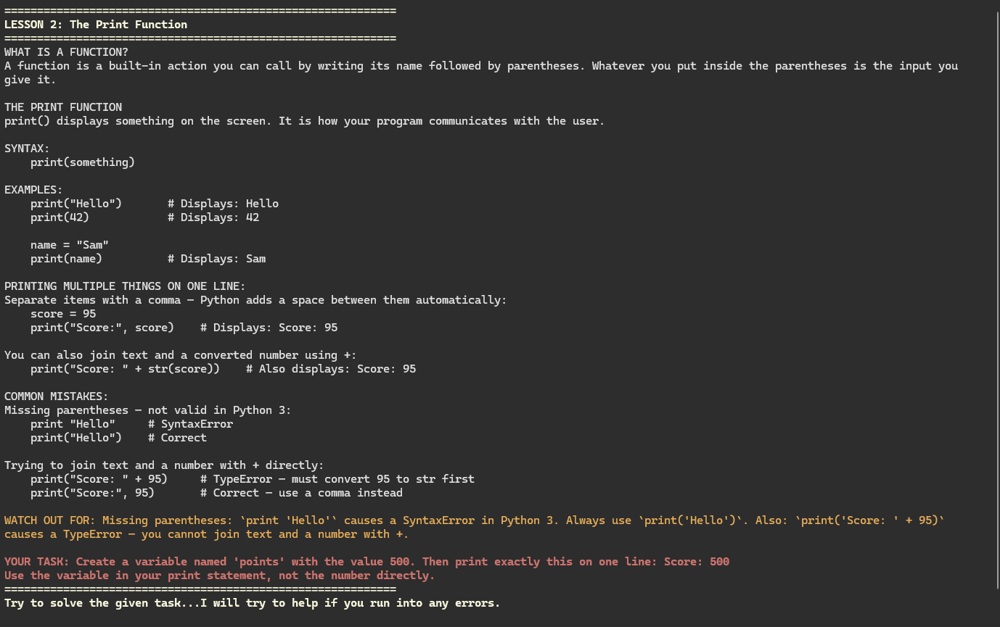
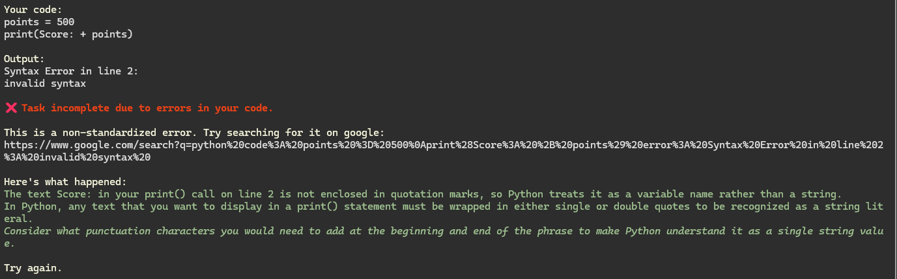

<div align="center">


[](https://www.python.org/downloads/)
[](https://opensource.org/licenses/Apache-2.0)
[-FFFFFF.svg?style=flat-square)](https://ollama.com/)
[](#why-it-works-this-way)

</div>

## PyFyve
***A completely offline, free Python tutor that guides you toward the answer — without ever giving it to you.***

<br>
<div align="center">
  
</div>
<br>

---

## What It Does

PyFyve gives beginners a step-by-step Python curriculum with a bundled editor for writing lesson code. For many non-standard Python errors, a locally-running AI model returns a three-sentence socratic hint:

1. What specifically went wrong in your code
2. Which Python rule you violated
3. A question that points you in the right direction — without telling you the fix

Common beginner errors are handled by built-in messages.

No internet required once it's set up. No subscriptions. No data leaves your machine.

---

## Why It Works This Way

Most learning tools — AI assistants, tutorials, Stack Overflow — just show you the answer. That feels helpful in the moment, but it skips the part where actual learning happens: figuring it out yourself.

PyFyve uses the Socratic method. You get a diagnosis, a rule, and a nudge. You still have to make the connection. That struggle is the point.

---

## How It Works

```
Read & Code: You are given a lesson and a task.
        ↓
PyFyve automatically generates a `user_workspace.py` file and opens it in the bundled Notepad++ editor.
        ↓
Sandbox Execution: When you save and close the editor, PyFyve compiles and runs your code in a restricted execution environment that uses AST checks and a whitelist of allowed builtins to block common dangerous imports and functions.
        ↓
Validation: A strict validator checks if your variables, loops, and outputs match the lesson requirements.
        ↓
Socratic AI: If the code crashes, the traceback is sent to the local Ollama server.
        ↓
The fine-tuned Qwen 3 4B model streams a 3-sentence Socratic hint back to your terminal.

```
<br><br>
<div align="center">


<br>
<b>1. Structured Lessons</b>

<br><br><br>


<br>
<b>2. Socratic AI Hints</b>

</div>

---

## System Requirements

| Component | Minimum                    | Recommended                     |
|-----------|----------------------------|---------------------------------|
| OS        | Windows 10 (build 1803+)   | Windows 11                      |
| RAM       | 8 GB                       | 16 GB                           |
| Storage   | 7 GB free (model + app)    | 15 GB free                      |
| CPU       | Any modern x86-64          | 6+ cores (speeds up model load) |
| GPU       | Not required               | Dedicated GPU (speeds up hints) |
| Internet  | Required on first run only | —                               |

**A note on AI hint speed:** PyFyve's hint model (a fine-tuned Qwen3 4B, ~2.5 GB) runs entirely on your machine through Ollama. The first hint of each session requires loading the model into memory — this is the slow part. After that, the model stays loaded and subsequent hints are fast.

Measured on real hardware:

| Hardware                                            | Model Loading        | Hints       |
|-----------------------------------------------------|----------------------|-------------|
| Dedicated GPU (RTX 3050)                            | ~3 seconds           | ~5 seconds  |
| CPU-only, modern laptop (i5-13450HX, GPU disabled)  | ~55 seconds          | ~20 seconds |
| CPU-only, 8 GB RAM, 10 virtual processors (Hyper-V) | ~1 minute 10 seconds | ~30 seconds |

**Important:** Once the model is loaded, PyFyve now keeps it in memory for the entire session. You will only experience the long cold-load once per session start, not between lessons. If you close the terminal window instead of using option 2, Ollama will continue holding the model in memory. Run "ollama stop fyve-ai" in a terminal window to free it.

---

## Getting Started
> Windows only. Linux and Mac are not supported in this version.

**There are two ways to use PyFyve depending on whether you want to install the app or run it from source.**

## Option 1: Install from Releases (recommended for most users)
If you just want to use PyFyve, this is the easiest option.

### Steps:

1. Go to the Releases page
2. Download the Windows installer .exe
3. Run the installer
4. Launch PyFyve from your Desktop shortcut or Start Menu

This option is intended for normal users who want the app installed like a standard Windows program.

## Option 2: Run from Source (for developers / repository clones)
If you cloned or downloaded this repository, launch PyFyve from the project folder.

### Steps:

1. Clone or download this repository
2. Keep the project folder structure intact
3. Double-click start.bat from the project root
4. **start.bat** attempts to automate the first-run setup for the source version:
<ul>
<li>checks for Python 3.13
<li>creates a Python virtual environment
<li>installs required libraries
<li>checks for Ollama
<li>offers to download the AI model if needed (~2.6 GB, one-time)
<li>launches PyFyve
</ul>

On later runs, start.bat usually only re-checks what is needed and then launches the app.

>**Important:** start.bat is for running PyFyve from source.
If you installed PyFyve using the Windows installer from the Releases page, launch it from your Desktop shortcut or Start Menu instead.

>**Note:** If you are running from source, keep **start.bat** in the project root folder and do not run src/main.py directly.

## Internet Requirement
PyFyve is designed to run offline **after setup**, but an internet connection may be needed during first-time installation or model download.

After the initial setup is complete, the app and AI hints run locally on your machine through Ollama.

---

## Project Structure

```
PyFyve/
├── assets               ← Launch PyFyve by double-clicking this
├── installer_output        ← Environment checks, Ollama + model setup
├── lessons/                ← Lesson JSON files (numbered, e.g. 1_0-intro.json)
├── model/                  ← AI model files — downloaded on first run (git-ignored)
├── npp/                    ← Bundled Notepad++ editor (Windows)
├── requirements.txt
├── src/                    ← All Python source files
│   ├── main.py             ← Lesson loop and entry point
│   ├── ai_response.py      ← AI hint generation via Ollama
│   ├── console.py          ← Rich terminal theme and shared UI helpers
│   ├── validator_test.py   ← Lesson validation rules
│   ├── user_code.py        ← Editor integration, sandboxed execution
│   ├── load_lessons.py     ← Load and display lesson JSON
│   └── load_progress.py    ← Save and restore lesson progress

```

---

## Lesson Format

Each lesson is a JSON file in `lessons/`:

```json
{
  "id": 1,
  "author": "Macmill-340",
  "topic": "Variables & Assignment",
  "text": "A variable is a named container for a value...",
  "common_errors": "Writing 100 = score instead of score = 100.",
  "task": "Create a variable called score and assign it the value 100.",
  "validation": [
    {"type": "variable_check", "var_info": {"score": 100}}
  ]
}
```

**Supported validation types:**
- `variable_check` — variables exist with the right names and values
- `output_check` — checks what your code prints
- `type_check` — checks the data type of a variable (int, str, list, etc.)
- `source_check` — checks that you used a specific keyword or method
- `collection_check` — checks lists and dicts for type, size, and contents

Lessons without a `task` field are treated as reading/intro lessons and advance automatically.

---

## The AI Model

The AI that powers PyFyve's hints is a custom fine-tuned model built for exactly one job: reading a Python error and responding with a Socratic 3-sentence hint. It cannot give you the answer, explain concepts freely, or write code for you. That's intentional.

The model is available on HuggingFace: **[Fyve-AI](https://huggingface.co/Macmill/Fyve-AI)**

The model runs entirely on your machine through Ollama. No internet connection is needed after the initial download.

**The model weights will be open-sourced soon along with the dataset used for training the model.**

---

## Limitations

**Please read these before using PyFyve. This is a prototype and an honest accounting of what it can and cannot do.**

**Windows only**
Linux and Mac are not supported. The editor integration uses a bundled Notepad++ (with Notepad as a fallback), which is Windows-specific.

**This is a prototype**
PyFyve is early-stage software built by one developer. Expect rough edges.

**The lessons are placeholders**
The included lessons cover the basic curriculum structure and are functional, but they are not the final curriculum. A more comprehensive set of lessons is in development.

**Infinite loops will freeze the app**
If you write `while True: pass` or any other infinite loop, the app will freeze with no recovery except closing the terminal. Avoid infinite loops until a timeout is implemented.

**`input()` is not supported**
Code that calls `input()` will fail with a NameError. The sandbox does not support interactive input — lessons are designed around this constraint.

**The AI model has real limits**
The model was trained on 555 examples of specific, well-defined Python errors. It performs well on common syntax and runtime errors. Known gaps: trailing comma creating a tuple (`x = 90,`), stray brackets in unusual positions, and logic errors where code runs without crashing but produces the wrong result.

**No hints for logic errors**
The AI only fires when Python raises an actual exception. If your code runs without errors but produces the wrong output, validation fails but no hint is given.

**AI hint speed on CPU-only machines**
The first hint of each session takes 1–2 minutes on a modern laptop without a dedicated GPU while the model loads into memory. Subsequent hints within the same session take 10–55 seconds depending on hardware. Closing and reopening PyFyve triggers another cold load. A dedicated GPU reduces all of these times to under 12 seconds.

---

## Roadmap

See [TODO.md](TODO.md) for the full list. Key items coming next:

- Infinite loop timeout
- AI hints for wrong answers (not just exceptions)
- Full beginner curriculum (While Loops, Functions, Dictionaries)
- Cross-platform editor support

---

## Contributing

See [CONTRIBUTING.md](CONTRIBUTING.md).

---

## Acknowledgements

PyFyve is built on the shoulders of several excellent open-source projects:

- **[Notepad++](https://github.com/notepad-plus-plus/notepad-plus-plus)** — the bundled code editor used for writing lessons. A free, open-source text editor for Windows, maintained by Don Ho and contributors under the GPL licence.

- **[Rich](https://github.com/Textualize/rich)** — the terminal formatting library that powers PyFyve's coloured output, styled prompts, and themed UI. Built by [Textualize](https://www.textualize.io/) and released under the MIT licence.

- **[Ollama Python](https://github.com/ollama/ollama-python)** — the Python client library used to communicate with the locally-running Ollama server that hosts the AI model. Released under the MIT licence.

- **[Ollama](https://ollama.com/)** — the local AI runtime that runs the fine-tuned hint model entirely on your machine. No data leaves your device.

---

## License

Apache 2.0